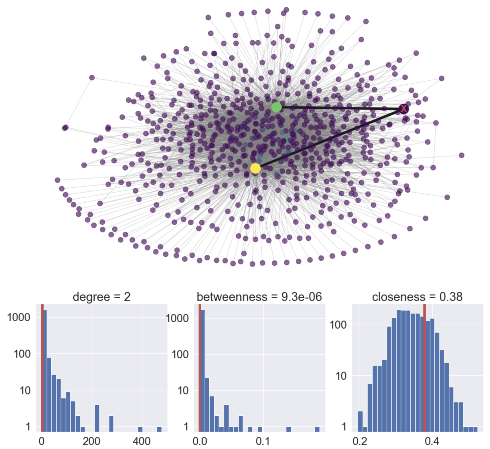

# Lightning Channel Optimizer

Lightning Channel Optimizer applies network analyses for choosing which nodes to set up payment channels with. 

## Introduction
When a new user joins the Lightning Network, they must decide which nodes to set up payment channels with. Currently, this is done manually by directly connecting to a shop or user you're already familiar with, or by going on to a website such as https://1ml.com and finding a node with many connections. However, if the Lightning Network is to scale and become a widely adopted payment solution for merchants for example, they will need a better way of selecting nodes to connect to. 

## Solution
The Lightning Channel Optimizer is a tool to help users find well connected nodes to form payment channels with. It runs in Jupyter Notebook and interacts with the command line interface for the c-lightning implementation. The tool performs three main steps:

  ### 1. Gets data from the Lightning Network
  It retreives all the active nodes and payment channels and returns the main graph    using the Networkx python library. 
  ### 2. Suggests nodes to connect 
  It will suggest a pre-specified numner of nodes to connect to which will maximize either the user's closeness or betweenness, based on their preferences. The suggested payment channels are visualized, as well as the node's predicted measures of closeness and betweenness if they  were to go ahead and set up these payment channels.
  ### 3. Set up payment channels
  The tool produces the commands which are executed by the c-lightning command line interface to set up and fund the new payment channels.
  
## Example

## Demo video
https://youtu.be/-TmEcGeq7r8

## Presentation slides
https://docs.google.com/presentation/d/1Qf7ViZ8pq5w_mWdkllIytp3D_btUA-TD2UpwQEDeqoc/edit?usp=sharing
